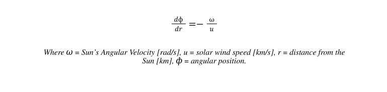

# README

The following README details the ParkerSolarWind program, written by Kaycee Conder this Spring of 2025 at the University of Wyoming. 

---

## Table of Contents
1. [Project Title: ParkerSolarWind](#project-title)
2. [Description](#description)
3. [Installation](#installation)
4. [Usage](#usage)
5. [Equations](#equations)
6. [Contributing](#contributing)
7. [License](#license)
8. [Acknowledgments](#acknowledgments)

---

## Project Title: ParkerSolarWind

The following project is the culmination of work throughout the University of Wyoming's PHYS4840 Spring 2025 Math and Computational Methods II Course under Dr. Meridith Joyce. Ultimately, this work has come together in the form my Final Project, entitled "ParkerSolarWind."

## Description

The purpose of this Python based project is to calculate the speed of the solar wind at a specified distance from the Sun utilizing the Parker Model of Solar Wind. More specifically, the output of this program will provide users with a specific value for this velocity (in km/s), alongside two supplemental plots: solar wind speed as a function of time, and a polar coordinate Parker Spiral plot. These additional plots are included in the output of the program in order to assist user understanding of their resulting speed in a broader scope. 

The primary pragmatic reason for the creation of this program is the uptake in the number of man-made satellites in our local region of space, the likes of which we depend very heavily on for daily needs such as GPS navigation. The speed of the solar wind, and its variation with the solar coronal temperature, can directly affect the trajectory of these satellites, potentially causing global security issues. Additionally, interplanetary satellite missions are vulnerable to these same issues (such as the Mars Reconnaissance Orbiter). Understanding the effects of the solar wind in these regions, and thus the creation of this program, is crucial to maintaining the integrity of both scientific space missions and global infrastructure. Of course, the ParkerSolarWind program is not the end-all-be-all to these concerns, but rather a contributing piece of code that can assist in tackling these large scale apprehensions. 

## Installation

There are two main avenues by which the ParkerSolarWind program can be installed: The Graphical User Interface (GUI) and the Command Line Interface (CLI). The following describes the installation process for the CLI interface as well as an overarching list of program dependencies and system requirements required regardless of GUI or CLI use. 

**Noted Requirements:**  
**-------------------------**

(1) *External Package Dependencies:* 

    Numpy
    MatPlotLib
    Math
    

(2) *System Requirements:* 

    Python3.8 or newer.
    TextEditor such as Vim or Sublime.
    Git.

If you do not meet any of these system requirements or have the necessary packages installed, please navigate to the following websites for assistance. Please note that installation processes will vary with your system (Windows vs macOS). 

*Package Installation:*

    (a) Numpy https://pypi.org/project/numpy/
    (b) Math  https://pypi.org/project/python-math/
    (c) MatPlotLib https://pypi.org/project/matplotlib/

*System Installation:*

    (a) Python https://www.python.org/downloads/
    (b) Sublime https://www.sublimetext.com/download
    (c) Vim https://www.vim.org/download.php
    (d) Git https://github.com/git-guides/install-git

**CLI Installation Steps:**  
**-------------------------------------**

**(1)** Navigate to the location on your local system where you would like to copy the ParkerSolarWind repository. 

**(2)** Ensure that you have Git installed on your system via the following: 

>$ git --version

**(3)** If Git is not installed, please use the link in the *System Installation* subsection above to do so. If it is installed, run the following command:

>$ git clone https://github.com/2021kconder/ParkerSolarWind.git

**Now, that the program files have been copied onto your local device, we need to change our environment variables:**
**----------------------------------------------------------------------------------------------------------------------------------**

**(1)** Navigate into the newly created structure. 

>$ cd ParkerSolarWind

**(2)** After navigating into this directory, the structure should appear as follows:

**(3)** You will need to change one environment variable in two .py files to run the program. The environment variable that you will be changing will be the interpreter. To find the interpreter for your local system, execute the following in the command line: 

> $ which python  

> Example Output: /Users/kayceeconder/anaconda3/bin/python3.11

This interpreter needs to replace the base interpreter set within the files:

     PSW_executable.py
    
     PSW_function_library.py
     
These two files are the files needed to run the program. 

**(4)** To enter in the correct interpreter variable, you will need to navigate into the aforementioned .py files using your preferred choice of text editor. I will describe how to do so via Vim & Sublime via a Linux system command line. 

>$ cd ParkerSolarWind/program_executables/

**For Vim...**  
**------------------**

> $ bash

>$ vim PSW_executable.py

You will see the following appear: 

Press 'i' on your keyboard to edit the text. Navigate to the '#!usr/local/Anaconda2023/bin/python3.11' line and replace 'usr/local/Anaconda2023/bin/python3.11' with your interpreter (the output of your 'which python' statement). 

To exit vim, press 'esc' on your keyboard. Then type ':wq' and press enter. You will now have saved and exited the file. 

Repeat the above steps but with the second file in the 'program_executables' folder. NOTE THAT THIS IS HOW YOU OPEN AND EDIT FILES VIA VIM IN GENERAL.

>$ vim PSW_funtion_library.py

You will change the interpreter in the exact same fashion. 

**For Sublime...**  
**----------------------**

>$ bash      

>$ subl PSW_executable.py

You should see the following appear: 

You may directly edit this text file by clicking on the line you want to edit. Replace the '#!usr/local/Anaconda2023/bin/python3.11' line and replace 'usr/local/Anaconda2023/bin/python3.11' with your interpreter (the output of your 'which python' statement). 

You can exit sublime via the 'x' in the upper left corner of the window. 

Repeat the above steps but with the second file in the 'program_executables' folder. NOTE THAT THIS IS HOW YOU OPEN AND EDIT FILES VIA SUBLIME IN GENERAL.

>$ sub PSW_function_library.py

**You can now prepare to run the program by proceeding as follows:**        
**--------------------------------------------------------------------------------------------**

(1) First, run the 'PSW_function_library.py' file by executing the following in bash:

>$ python PSW_function_library.py

You should receive the following output message:

>> 'ParkerSolarWind Function Library Updated.'

(2) You are now ready to change the input variables for this problem and run the program. The 'PSW_executable.py' file will be run in order to obtain the program outputs. For more information on input manipulation and expected outputs, please see the 'Usage' section of this README file. 

## Usage

**Inputs**  
**---------------**

When executing this project, there are five key input parameters that you can manipulate via your respective choice of code editor. For a walk-through of how to edit code in the text editors of Sublime & Vim, please refer to the 'Installation' section above. A description of the program inputs and where you can edit them are as follows: 

**(1) Coronal Temperature:** 

    A temperature you want to assume for the corona of the Sun. This value should be given in units of Kelvin, and must exist within the range of 0.5 million to 4 million Kelvin. This is done for maintaining some level of physical validity. 

**(2) Radial Distance:** 

    The distance from the Sun at which you want to determine the speed of the solar wind. This distance should be given in units of kilometers, and must exist within the range of the Critical Radius (See 'Equations' Section) to 766.45 million km (the orbit of Jupiter). The distance value is constrained to inside of Jupiter's orbit in order on the region of the inner solar system, where many of our satellites of concern are located.  

**(3) Solar Wind Data Output FilePath:** 

    This file path describes where our output two column data file, containing Radial Distance From the Sun [km] and Solar Wind Speed [km/s] values, is written to. Both the location of the text file and the name of the text file can be manipulated via this input parameter. 

**(4) Solar Wind Graph Output FilePath:** 

    This file path describes the location where our output graph, depicting solar wind as a function of distance from the Sun, is written. Both the location of the .png and the name of the .png can be manipulated via this input parameter. 

**(5) Parker Spiral Output FilePath:** T

    his file path describes the location where our output graph, depicting the angular location of the Sun's magnetic field as a function of distance, is written. Both the location of the .png and the name of the .png can be manipulated via this input parameter.

An image of the location of these input parameters and where they can be changed is provided below: 

**Outputs**  
**----------------**

We can now examine the outputs of the program in more detail, examining their format and physical significance. A description of the program outputs are as follows: 

**(1) Solar Wind Value:** 

    A specific value for the solar wind at the input 'Radial Distance' location. The units of this value are given in km/s, and this output is directly printed into the command line output after the program is run. 

**(2) Solar Wind Data File:** 

    A text file, written to the input 'Solar Wind Data Output FilePath.' This is specifically a two-column data file that lists the Radial Distance From the Sun [km] and Solar Wind Speed [km/s] values, as determined via the Fourth Order Runge-Kutta method.

**(3) Solar Wind Graph:** 

    This graph depicts the dependence of solar wind speed [km/s] on distance [km] from the Sun. The location of this curve, and the overall speed distribution, is dependent on the input 'Coronal Temperature', with higher temperatures corresponding to overall higher velocity distributions. 

    The solar wind value at the input 'Radial Distance' location is specifically marked on the curve to indicate its location amongst the distribution. Additionally, the radial distance from the Sun to the Earth is highlighted as a reference point, as well as the critical radius, where the solar wind transitions from subsonic to supersonic speeds. This output is saved as a .png file to your specified input 'Solar Wind Graph Output FilePath' location. It will not pop up on its own during the program runtime. 

**(4) Parker Spiral Graph:** 

    This graph depicts the angular position of the Sun's magnetic field, the likes of which is shaped by both the Sun's angular rotation speed and the speed of the solar wind. This figure is not crucial in understanding the solar wind dependence as a function of distance from the Sun but rather exists as a supplemental figure that assists in the understanding of the impacts of the solar wind speed on factors such as magnetic field line location. The distribution of these lines is directly dependent on the 'Coronal Temperature' input, as higher temperatures correspond to overall higher velocity distributions (as mentioned within the 'Solar Wind Graph' description). Higher velocity distributions lead to a much more 'dispersed' Parker Spiral whereas lower velocity distributions lead to a much tighter spiral. 

    On our output graph specifically, the the input 'Radial Distance' is highlighted alongside all corresponding radii for all angular distributions. Additionally, two reference distances will be marked depending on whether the 'Radial Distance' input value is inside or outside the orbit of Mars. For input values within Mars' orbit, the distance from the Sun to Earth and Venus are marked as references, whereas input values outside of Mars' orbit have Earth and Jupiter's distances marked as references. This output is saved as a .png file to your specified input 'Parker Spiral Output FilePath' location. It will not pop up on its own during the program runtime.

The above images depicted example outputs for an input of 4 million Kelvin and a 'Radial Distance' of 228 million km. To view these outputs in further detail, please refer to the 'test_case' folder of this repository. 

**Running The Program**  
**-------------------------------**

Once you have run the PSW_function_library.py, as instructed in the 'Installation' section of this README, you can execute the following commands in bash (or a corresponding shell) to run the program after changing your input parameters:

> $ python PSW_executable.py

Ensure that you are running this either in the  /ParkerSolarWind/executables/ directory, or are adding the filepath of the executable location to your command. Your solar wind output will then appear in the command line, and the graphs will be saved to your specified input directory. 

**Basic Operation Processes**  
**---------------------------------**

The following numerical methods exist as the foundation of this program, with their purposes described herein: 

**(1) Fourth Order Runge-Kutta Method (RK4):** This method of solving ordinary differential equations is utilized in order to solve the Parker Model of Solar Wind ODE below: 

The application of this method to the above equation yields a set of distance [km] and velocity [km/s] values that describe the relationship between solar wind speed and distance from the Sun. 

**(2) Linear Interpolation:** This method of finding values 'in between' a known set of points is utilized in order to calculate a solar wind speed for any given input radius. In other words, the input radius does not have to exist as an integer or a multiple of a certain value (the step size for our RK4 method) in order to return a solar wind value. In order to accomplish this, the program first finds the two RK4 generated values that are closest to our input radius, i.e. the 'straddling' points. A visual demonstration of how this is accomplished utilizing our fixed step size and array indices is provided below: 

After determining these closest points, we then consider them to be connected via a straight line. The program then determines the slope and intercept of this line, and assuming the input 'Radial Distance' to fall along this line, we can determine the solar wind value at this point via y=mx+b.

**(3) Euler's Method:** This method of solving ordinary differential equations is utilized in order to solve the Parker Spiral angular position ODE below: 

The application of this method to the above equation yields a set of angular position (phi) values as as a function of solar distance [km]. 

*For more information on the PSW_function_library.py equations, the likes of which are imported but not directly written in the PSW_executable.py, please see the section below. For more information on an example case, detailing the inputs, outputs and process, please see the files in the 'test_case' folder.*

## Equations 

The following equations are key to the operation and understanding of the ParkerSolarWind program. We will discuss each equation in the order in which they are used, highlighting both their physical meaning and where they can be found in the PSW_function_library.py. **Note however that none of these functions need to be edited for the operation of the program. Their functionality will only be changed via user input changes, and the discussion of these equations is meant as more of a foundation for the physical implications and inner workings of the program.**

**Equation 1: Critical Radius**  
**------------------------------------**

The critical radius is defined as the location at which the solar wind makes the transition from sub-sonic to super-sonic speeds. This parameter is integral to our solving of the Parker Model of Solar Wind ODE, and is inversely proportional to the input 'Coronal Temperature.' This quantity is also dependent on two set quantities: 'T0', a derived temperature much greater than the corona at 5.8 million Kelvin and 'a', the solar radius.

**Equation 2: Coronal Sound Speed**  
**----------------------------------------------**

The coronal sound speed is defined as the speed a which sound waves travel through the Sun's corona. In particular, this equation is equivalent to the most probable speed via the Maxwell Speed Distribution. This parameter is integral to our solving of the Parker Model of Solar Wind ODE, and it is directly proportional to the input 'Coronal Temperature.' 

**Equation 3: Parker Model of Solar Wind ODE**  
**----------------------------------------------------**

The Parker Model of Solar Wind ODE is derived given the radial equation of motion for the solar corona and the pressure of the solar corona (assuming a purely radial, steady-state, isothermal coronal outflow). This ODE is directly dependent on the input 'Coronal Temperature' via its use of the critical radius and coronal sound speed. The physically viable solution to this equation is determined by assuming the following initial conditions: 

**Equation 4: Parker Spiral Angular Position ODE**  
**-------------------------------------------------------**

*For a thorough discussion of the derivation of these equations, please refer (1) in the 'Key Resources' section.*
   

## Contributing

If you wish to contribute to this program the corresponding code, please do! I would love any external feedback/contributions to this project. To do so, please follow the following instructions (assuming a based understanding of git and its commands):

(1) Fork the ParkerSolarWind repository.

(2) Create a new branch for your suggested contribution

(3) Submit a pull request with a detailed description of your changes.

## License

MIT License

Copyright (c) [2025] [Kaycee Conder]

Permission is hereby granted, free of charge, to any person obtaining a copy
of this software and associated documentation files (the "Software"), to deal
in the Software without restriction, including without limitation the rights
to use, copy, modify, merge, publish, distribute, sublicense, and/or sell
copies of the Software, and to permit persons to whom the Software is
furnished to do so, subject to the following conditions:

The above copyright notice and this permission notice shall be included in all
copies or substantial portions of the Software.

THE SOFTWARE IS PROVIDED "AS IS", WITHOUT WARRANTY OF ANY KIND, EXPRESS OR
IMPLIED, INCLUDING BUT NOT LIMITED TO THE WARRANTIES OF MERCHANTABILITY,
FITNESS FOR A PARTICULAR PURPOSE AND NONINFRINGEMENT. IN NO EVENT SHALL THE
AUTHORS OR COPYRIGHT HOLDERS BE LIABLE FOR ANY CLAIM, DAMAGES OR OTHER
LIABILITY, WHETHER IN AN ACTION OF CONTRACT, TORT OR OTHERWISE, ARISING FROM,
OUT OF OR IN CONNECTION WITH THE SOFTWARE OR THE USE OR OTHER DEALINGS IN THE
SOFTWARE.

## Acknowledgments

**Key Resources**  
**-------------------------**

(1) University of Texas, *Parker Model of Solar Wind* (Fitzpatrick 2016) https://farside.ph.utexas.edu/teaching/plasma/Plasma/node90.html 

(2) University of Arizona, *The Parker spiral magnetic field* (Giacalone 2022) https://heliophysics.ucar.edu/sites/default/files/heliophysics/resources/presentations/giacalone-parkerspiral.pdf

**Thanks**  
**---------------**

Author K. Conder thanks Professor Meridith Joyce for a wonderful semester in PHYS4840!
